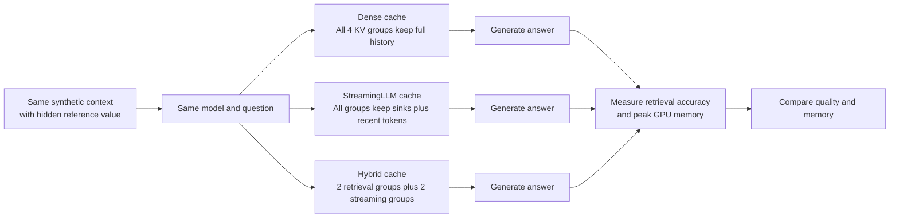

# Hybrid Streaming Attention

A Google Colab research project that tests whether different attention groups should keep different amounts of long-context history.

The project combines ideas from:

- [StreamingLLM: Efficient Streaming Language Models with Attention Sinks](https://arxiv.org/abs/2309.17453)
- [DuoAttention: Efficient Long-Context LLM Inference with Retrieval and Streaming Heads](https://arxiv.org/abs/2410.10819)

## Research question

Long-context language models store key-value (KV) states for previous tokens. As the context becomes longer, the KV cache uses more GPU memory.

This project checks whether a hybrid cache can:

- Use less memory than a fully dense cache.
- Retrieve old information better than uniform StreamingLLM eviction.
- Continue working at long context lengths on a limited Colab GPU.

The experiment focuses on retrieval accuracy and GPU memory. Generation speed is not used as a main metric.

## Architecture



## Model and environment

- Model: `Qwen/Qwen2.5-7B-Instruct`
- Model family: Qwen2-compatible decoder-only transformer
- Model size: approximately 7 billion parameters
- Runtime: Google Colab GPU
- Quantization: 4-bit NF4 with double quantization
- Compute type: FP16 on T4-class GPUs
- Attention implementation: PyTorch SDPA
- Transformers: `5.15.1`
- BitsAndBytes: `0.49.2`
- Random seed: `42`

The 7B model fits the tested Colab GPU in 4-bit mode. However, the full dense cache does not fit at an 8,192-token context on the tested GPU.

## Cache policies

| Method | Cache behavior | Purpose |
|---|---|---|
| Dense | All 4 KV groups retain the complete history | Quality and memory reference |
| StreamingLLM | All groups retain 4 sink tokens and a recent-token window | Low-memory baseline |
| Hybrid | 2 retrieval groups retain full history; 2 streaming groups use sink-plus-recent eviction | Main research method |

The hybrid configuration uses:

- Sink tokens: 4
- Recent-token budget: 512
- Retrieval KV groups: 2
- Streaming KV groups: 2

The retrieval groups are not processed only once. During every generation step, they use their full KV history to search for older information. The streaming groups use their smaller bounded cache at the same time, and both outputs are combined.

## Dataset

The project uses a synthetic needle-in-a-haystack benchmark.

Each sample contains:

- A long artificial context.
- One hidden reference value.
- A retrieval question.
- A randomly generated code such as `BTRQJGF5`.

The random codes are intentional. They test exact retrieval rather than memorized knowledge.

The benchmark contains:

- 2,048-token contexts.
- 4,096-token contexts.
- 8,192-token contexts.
- Early, middle, and late needle positions.
- Three samples for each context length and position.
- 27 total samples.

## Implementation changes

The original StreamingLLM idea applies the same eviction policy to every attention group. That reduces memory but can remove an old fact from the cache.

This project adds a lightweight DuoAttention-inspired improvement:

1. The model is loaded with a modern Transformers setup.
2. A custom `HybridCache` stores retrieval and streaming KV states separately.
3. Retrieval groups keep their complete history.
4. Streaming groups keep sink and recent tokens.
5. Qwen attention is adapted to process the two groups separately.
6. The resulting attention outputs are combined before the output projection.
7. The final experiment compares dense, StreamingLLM, and hybrid behavior.

The implementation is a lightweight research prototype. It is not a complete reproduction of the official DuoAttention calibration and optimized kernel system.

## Evaluation

The experiment measures:

- Needle retrieval accuracy.
- Peak GPU memory.
- Whether the configuration completes or runs out of memory.

A retrieval is counted as correct when the generated response contains the expected reference value.

## Final results

### Execution status

| Method | Completed samples | Out-of-memory samples |
|---|---:|---:|
| Dense | 18 | 9 |
| StreamingLLM | 27 | 0 |
| Hybrid | 27 | 0 |

### Retrieval and memory results

| Context | Method | Retrieval accuracy | Average peak memory |
|---:|---|---:|---:|
| 2,048 | Dense | 100.0% | 6.47 GB |
| 2,048 | StreamingLLM | 0.0% | 5.65 GB |
| 2,048 | Hybrid | 77.8% | 5.50 GB |
| 4,096 | Dense | 100.0% | 9.75 GB |
| 4,096 | StreamingLLM | 0.0% | 6.01 GB |
| 4,096 | Hybrid | 88.9% | 5.57 GB |
| 8,192 | Dense | Not available | Out of memory |
| 8,192 | StreamingLLM | 0.0% | 6.73 GB |
| 8,192 | Hybrid | 66.7% | 5.67 GB |

The dense 8,192-token configuration has no accuracy value because all nine samples ran out of GPU memory during execution.

## Main findings

- Dense caching achieved 100% retrieval accuracy at 2,048 and 4,096 tokens.
- Dense caching failed on all 8,192-token samples because of GPU memory usage.
- StreamingLLM completed every sample but achieved 0% retrieval accuracy on this benchmark.
- The hybrid cache completed every sample, including all 8,192-token samples.
- Hybrid retrieval accuracy was 77.8% at 2,048 tokens, 88.9% at 4,096 tokens, and 66.7% at 8,192 tokens.
- Compared with StreamingLLM, hybrid retrieval improved by 77.8, 88.9, and 66.7 percentage points at the three context lengths.
- Hybrid memory was 15.0% lower than dense memory at 2,048 tokens.
- Hybrid memory was 42.9% lower than dense memory at 4,096 tokens.
- The hybrid method did not match dense-cache accuracy, but it provided a better quality-memory trade-off than uniform StreamingLLM eviction.

## Visualizations

The notebook produces visualizations showing:

- Which tokens each cache policy keeps.
- Where retrieval succeeds or fails.
- Which configurations run out of memory.
- The relationship between retrieval accuracy and peak memory.

The most important visual is the retrieval-memory comparison. It shows whether a method can remain accurate without requiring the complete dense KV cache.

## Repository structure

```text
hybrid-streaming-attention/
├── hybrid_streaming_attention.ipynb
├── README.md
├── data/
│   ├── needle_dataset.jsonl
│   └── needle_dataset_metadata.csv
├── results/
│   ├── dense_results.csv
│   ├── dense_summary.csv
│   ├── optimized_hybrid_results.csv
│   ├── all_experiment_results.csv
│   ├── final_result_summary.csv
│   └── retrieval_by_depth.csv
└── visualizations/
    ├── cache_policy_explanation.png
    ├── retrieval_outcome_grid.png
    └── retrieval_memory_tradeoff.png
```

## Reproduce the experiment

1. Open the notebook in Google Colab.
2. Select a GPU runtime.
3. Install the pinned dependencies.
4. Load `Qwen/Qwen2.5-7B-Instruct` in 4-bit mode.
5. Generate the synthetic needle dataset.
6. Run the dense, StreamingLLM, and hybrid experiments.
7. Run the final results and visualization section.
8. Save the generated CSV files and images.

Memory results can change slightly depending on the Colab GPU and runtime state.

## Limitations

- The dataset is synthetic rather than real-world text.
- The experiment uses a small number of samples.
- The model is a 7B model running in 4-bit mode.
- The hybrid head selection is lightweight and not the full official DuoAttention calibration procedure.
- The dense 8,192-token baseline could not run on the tested GPU.
- The final reported hybrid results use the SDPA implementation, not the optional Triton decode path.
- This project demonstrates the central idea of DuoAttention but should not be described as a complete reproduction.

## Conclusion

StreamingLLM reduces KV-cache memory by retaining sink and recent tokens, but the experiment shows that uniform eviction can destroy long-context retrieval.

The hybrid cache improves this behavior by preserving full history for selected retrieval groups while applying bounded eviction to streaming groups.

In this experiment, the hybrid method:

- Used less memory than dense caching at shorter contexts.
- Completed contexts where dense caching ran out of memory.
- Retrieved substantially more hidden information than pure StreamingLLM.

The main lesson is:

> Different attention groups may need different amounts of context history.
