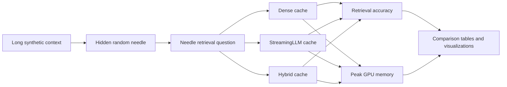
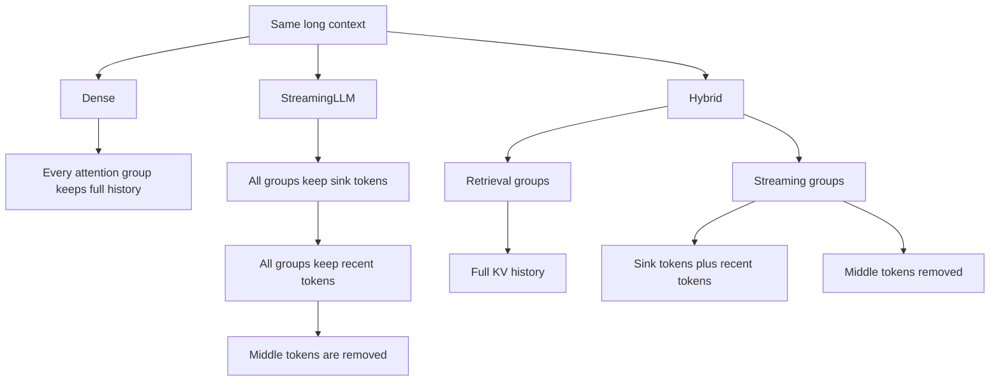

# Hybrid Streaming Attention

A Google Colab research project that tests whether a hybrid KV-cache policy can preserve long-context retrieval while using less GPU memory.

The project combines the main ideas from:

- [StreamingLLM: Efficient Streaming Language Models with Attention Sinks](https://arxiv.org/abs/2309.17453)
- [DuoAttention: Efficient Long-Context LLM Inference with Retrieval and Streaming Heads](https://arxiv.org/abs/2410.10819)

## Why this experiment?

Long-context language models store key-value states for previous tokens. As the context becomes longer, this cache consumes more GPU memory.

StreamingLLM reduces memory by keeping:

- A few initial sink tokens
- Recent tokens
- Removing middle tokens

This makes long-context generation possible, but old facts can disappear from the cache.

DuoAttention improves this idea by treating attention heads differently:

- Retrieval heads keep the complete history.
- Streaming heads use the smaller sink-plus-recent cache.

This project tests whether that hybrid strategy can retrieve old information better than StreamingLLM while using less memory than a fully dense cache.

## Project architecture



## Cache policies



## What was implemented?

The experiment uses:

- Model: `meta-llama/Llama-3.2-3B-Instruct`
- Runtime: Google Colab GPU
- Precision: 4-bit quantization
- Attention backend: PyTorch SDPA
- Cache interface: custom hybrid cache
- Retrieval groups: 2 groups per layer
- Streaming groups: 2 groups per layer
- Sink tokens: 4
- Recent-token cache budget: 512 tokens

The hybrid implementation is a lightweight DuoAttention-inspired prototype. It does not reproduce the complete official DuoAttention calibration and kernel system.

## Dataset

The benchmark uses a synthetic needle-in-a-haystack dataset.

Each sample contains:

- A long artificial context
- One hidden fact
- A random reference value such as `BTRQJGF5`
- A question asking the model to retrieve that value

The random values are intentional. They prevent the model from answering from memorized knowledge.

The dataset contains:

- 2,048-token contexts
- 4,096-token contexts
- 8,192-token contexts
- Early, middle, and late needle positions
- Three samples for each context length and position
- 27 total samples

## Compared methods

| Method | Cache behavior | Purpose |
|---|---|---|
| Dense | Keeps the complete KV history for every group | Quality and memory reference |
| StreamingLLM | Keeps sink tokens and recent tokens for every group | Uniform cache eviction baseline |
| Hybrid | Keeps full history for retrieval groups and compressed history for streaming groups | Main research method |

## Evaluation

The project measures two main outcomes:

1. **Needle retrieval accuracy**  
   Whether the model retrieves the correct hidden reference value.

2. **Peak GPU memory**  
   The highest GPU memory used during generation.

Speed is not used as a main evaluation metric because the central research question is the trade-off between retrieval quality and KV-cache memory.

## Final results

### Overall execution

| Method | Completed samples | Out-of-memory samples |
|---|---:|---:|
| Dense | 18 | 9 |
| StreamingLLM | 27 | 0 |
| Hybrid | 27 | 0 |

### Accuracy and memory

| Context | Method | Retrieval accuracy | Average peak memory |
|---:|---|---:|---:|
| 2,048 | Dense | 100.0% | 6.47 GB |
| 2,048 | StreamingLLM | 0.0% | 5.65 GB |
| 2,048 | Hybrid | 77.8% | 5.50 GB |
| 4,096 | Dense | 100.0% | 9.75 GB |
| 4,096 | StreamingLLM | 0.0% | 6.01 GB |
| 4,096 | Hybrid | 88.9% | 5.57 GB |
| 8,192 | Dense | Not available | Out of memory |
| 8,192 | StreamingLLM | 0.0% | 6.73 GB |
| 8,192 | Hybrid | 66.7% | 5.67 GB |

The dense 8,192-token configuration ran out of GPU memory, so it has no retrieval-accuracy value.

## Main findings

- Dense caching achieved 100% retrieval accuracy at 2,048 and 4,096 tokens, but failed at 8,192 tokens because of GPU memory limits.
- StreamingLLM completed all context lengths, but achieved 0% retrieval accuracy on this needle benchmark.
- The hybrid cache completed all context lengths and achieved 77.8% accuracy at 2,048 tokens, 88.9% at 4,096 tokens, and 66.7% at 8,192 tokens.
- Compared with StreamingLLM, the hybrid method improved retrieval accuracy at every tested context length.
- At 2,048 tokens, hybrid memory was 15.0% lower than dense memory.
- At 4,096 tokens, hybrid memory was 42.9% lower than dense memory.
- The hybrid method did not match dense-cache accuracy, but it provided a better balance between retrieval and memory than uniform StreamingLLM eviction.

## How to read the visualizations

### Cache policy diagram

- Blue means full KV history is kept.
- Green means sink tokens are kept.
- Orange means recent tokens are kept.
- Gray means middle tokens are removed.

The hybrid method has two different cache behaviors because it separates retrieval groups from streaming groups.

### Retrieval outcome grid

- Green means the hidden value was retrieved correctly.
- Yellow means some samples succeeded and some failed.
- Red means the completed samples failed.
- Gray means the method ran out of memory.

### Retrieval-memory plot

- Higher position means better retrieval accuracy.
- More left means lower memory use.
- The best region is the upper-left area: high accuracy with low memory.

## Repository contents

```text
hybrid-streaming-attention/
├── hybrid_streaming_attention.ipynb
├── README.md
├── data/
│   ├── needle_dataset.jsonl
│   └── needle_dataset_metadata.csv
├── results/
│   ├── dense_results.csv
│   ├── dense_summary.csv
│   ├── optimized_hybrid_results.csv
│   ├── all_experiment_results.csv
│   ├── final_result_summary.csv
│   └── retrieval_by_depth.csv
└── visualizations/
    ├── cache_policy_explanation.png
    ├── retrieval_outcome_grid.png
    └── retrieval_memory_tradeoff.png
```

## Reproducibility

1. Open the notebook in Google Colab.
2. Enable a GPU runtime.
3. Install the required packages.
4. Run the notebook from beginning to end.
5. Save the generated CSV files and visualizations.
6. Compare the dense, StreamingLLM, and hybrid results.

The reported memory values are measurements from the Colab run and may change slightly depending on the GPU type and runtime state.

## Limitations

- The benchmark uses synthetic contexts rather than real documents.
- The model is a small 3B-parameter model selected for free Colab.
- The hybrid head selection is a lightweight probe-based approximation.
- This is not a complete reproduction of the official DuoAttention system.
- The dense 8,192-token baseline could not run on the available GPU.
- Retrieval accuracy is based on a small number of synthetic samples.

## Conclusion

This project shows the main weakness of uniform StreamingLLM eviction: it reduces memory but can lose distant facts.

The hybrid cache improves this behavior by preserving full history for selected retrieval groups while applying StreamingLLM-style eviction to the remaining groups. In the experiment, the hybrid method retained long-context retrieval at 8,192 tokens, where dense caching ran out of memory, and performed substantially better than pure StreamingLLM.

The project therefore demonstrates a practical research idea:

> Different attention groups may need different amounts of history.
