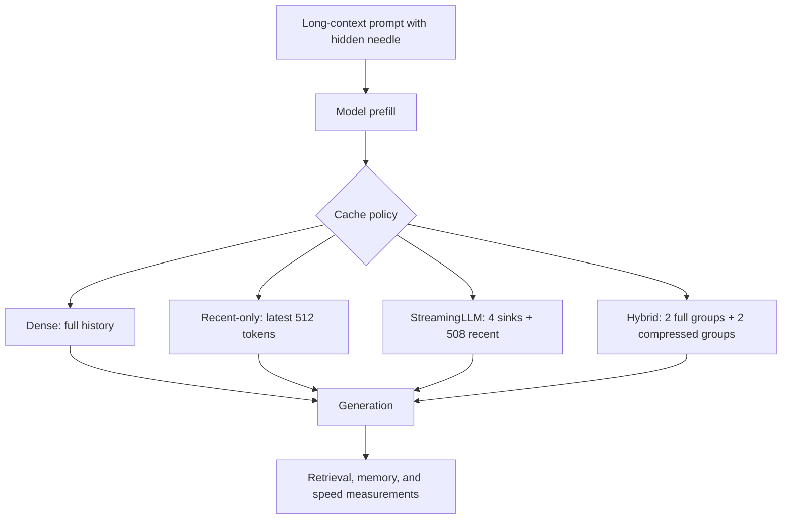

# Hybrid Streaming Attention

A Colab-based research project combining the main idea of StreamingLLM with a lightweight DuoAttention-style hybrid KV-cache policy.

The project tests whether keeping the full KV history for only selected attention groups can preserve long-context retrieval while using less memory than a fully dense KV cache.

## Research idea

### StreamingLLM

StreamingLLM reduces KV-cache memory by keeping:

- Four attention-sink tokens.
- The most recent 508 tokens.
- No middle tokens.

The total streaming cache is therefore limited to 512 tokens per KV group.

### Hybrid approach

DuoAttention shows that different attention heads may need different amounts of history:

- Retrieval heads need older tokens to recover information from far back in the context.
- Streaming heads can operate with attention sinks and recent tokens.

This project implements a lightweight version of that idea:

- Two KV groups keep their full history.
- Two KV groups use four sink tokens plus 508 recent tokens.

The hybrid policy is compared against dense, recent-only, and StreamingLLM policies.

## Cache policies

| Mode | Cache policy | Purpose |
|---|---|---|
| Dense | Full KV history for every KV group | Quality and memory reference |
| Recent-only | Latest 512 tokens only | Plain sliding-window control |
| StreamingLLM | Four sink tokens plus 508 recent tokens | StreamingLLM baseline |
| Hybrid | Two full-history groups plus two sink/recent groups | DuoAttention-style hybrid |

## Architecture

## Evaluation

Each policy was tested using synthetic needle-in-a-haystack prompts.

The hidden fact was placed at three positions:

- Early
- Middle
- Late

The experiments used context lengths of:

- 2,048 tokens
- 4,096 tokens
- 8,192 tokens

The following metrics were recorded:

- Retrieval accuracy.
- Average peak GPU memory.
- Maximum peak GPU memory.
- Average generation speed in tokens per second.
- Out-of-memory failures.

## Execution status

| Mode | Status | Completed samples |
|---|---|---:|
| Dense | Completed for shorter contexts; out of memory for 8,192-token contexts | 18 completed, 9 OOM |
| Recent-only | Completed | 27 |
| StreamingLLM | Completed | 27 |
| Hybrid | Completed | 27 |

The dense policy ran out of memory for all nine 8,192-token samples.

## Main results

| Context | Mode | Accuracy | Average peak memory | Speed |
|---:|---|---:|---:|---:|
| 2,048 | Dense | 100.0% | 6.47 GB | 4.37 tok/s |
| 2,048 | Recent-only | 0.0% | 5.92 GB | 5.38 tok/s |
| 2,048 | StreamingLLM | 0.0% | 5.65 GB | 5.24 tok/s |
| 2,048 | Hybrid | 77.8% | 5.58 GB | 2.18 tok/s |
| 4,096 | Dense | 100.0% | 9.75 GB | 1.87 tok/s |
| 4,096 | Recent-only | 0.0% | 6.28 GB | 3.53 tok/s |
| 4,096 | StreamingLLM | 0.0% | 6.01 GB | 3.48 tok/s |
| 4,096 | Hybrid | 88.9% | 5.64 GB | 1.24 tok/s |
| 8,192 | Dense | Out of memory | Not available | Not available |
| 8,192 | Recent-only | 0.0% | 7.00 GB | 2.01 tok/s |
| 8,192 | StreamingLLM | 0.0% | 6.73 GB | 2.02 tok/s |
| 8,192 | Hybrid | 66.7% | 5.75 GB | 0.67 tok/s |

## Retrieval accuracy by depth

| Context | Depth | Dense | Recent-only | StreamingLLM | Hybrid |
|---:|---|---:|---:|---:|---:|
| 2,048 | Early | 100.0% | 0.0% | 0.0% | 66.7% |
| 2,048 | Middle | 100.0% | 0.0% | 0.0% | 66.7% |
| 2,048 | Late | 100.0% | 0.0% | 0.0% | 100.0% |
| 4,096 | Early | 100.0% | 0.0% | 0.0% | 100.0% |
| 4,096 | Middle | 100.0% | 0.0% | 0.0% | 66.7% |
| 4,096 | Late | 100.0% | 0.0% | 0.0% | 100.0% |
| 8,192 | Early | OOM | 0.0% | 0.0% | 66.7% |
| 8,192 | Middle | OOM | 0.0% | 0.0% | 66.7% |
| 8,192 | Late | OOM | 0.0% | 0.0% | 66.7% |

## Interpretation

The dense policy achieved perfect retrieval at 2,048 and 4,096 tokens, but it exceeded available memory at 8,192 tokens.

Recent-only and StreamingLLM used bounded caches, but both achieved 0% retrieval accuracy in these tests. This shows the weakness of removing old context uniformly: information placed outside the retained window could not be recovered.

The hybrid policy recovered substantial long-context retrieval:

- 77.8% accuracy at 2,048 tokens.
- 88.9% accuracy at 4,096 tokens.
- 66.7% accuracy at 8,192 tokens.

Compared with StreamingLLM, the hybrid improved retrieval by:

| Context | Hybrid improvement |
|---:|---:|
| 2,048 | +77.8 percentage points |
| 4,096 | +88.9 percentage points |
| 8,192 | +66.7 percentage points |

Compared with dense caching, the hybrid used:

- 13.8% less memory at 2,048 tokens.
- 42.2% less memory at 4,096 tokens.
- It remained operational at 8,192 tokens, while dense caching ran out of memory.

The hybrid was slower than the other compressed policies in this implementation. At 2,048 tokens it generated 2.18 tokens per second, compared with 5.24 tokens per second for StreamingLLM. At 4,096 tokens it generated 1.24 tokens per second, compared with 3.48 tokens per second for StreamingLLM.

This means the current hybrid implementation demonstrates a clear memory-versus-retrieval trade-off, but it is not yet a speed-optimized implementation.

## Final conclusion

The experiment supports the main motivation behind DuoAttention:

> Keeping full history for only some KV groups can recover long-range retrieval that uniform StreamingLLM eviction loses.

The hybrid cache did not match the dense cache’s perfect accuracy, but it used less memory and continued working at 8,192 tokens, where the dense policy failed with an out-of-memory error.

The main limitation is speed. The current implementation uses a research-oriented hybrid policy but does not include the specialized kernel optimizations used in the original DuoAttention implementation.

## Project workflow

The notebook performs the following steps:

1. Creates long-context needle-retrieval prompts.
2. Runs the dense cache reference.
3. Runs the recent-only control.
4. Runs the StreamingLLM cache.
5. Runs the hybrid cache.
6. Measures retrieval accuracy, GPU memory, and generation speed.
7. Reports out-of-memory cases.
8. Produces comparison tables and charts.

## References

- Xiao et al., “Efficient Streaming Language Models with Attention Sinks,” StreamingLLM, ICLR 2024.
- Xiao et al., “DuoAttention: Efficient Long-Context LLM Inference with Retrieval and Streaming Heads,” ICLR 2025.
